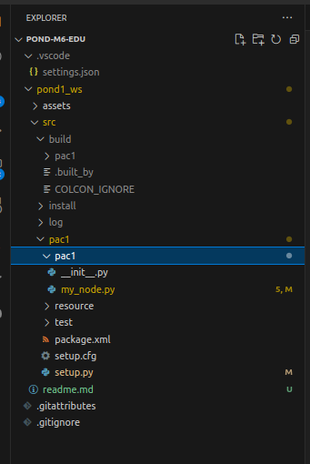
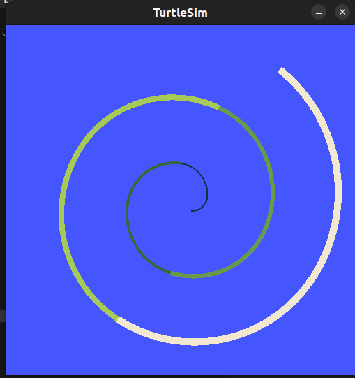
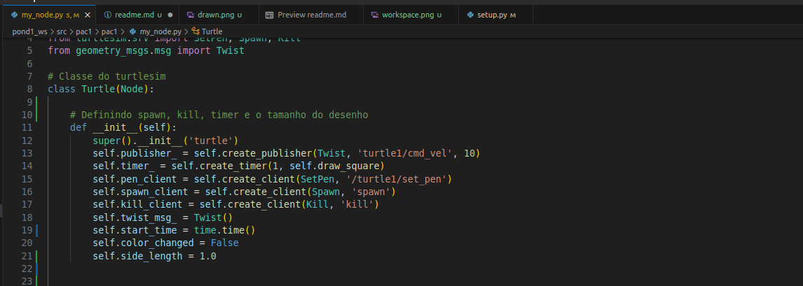

# Atividade ponderada - 1

## Objetivo 
O objetivo dessa atividade é criar um pacote ros para interagir com a tartaruga do turtlesim.

## Atividades Desenvolvidas 

Nesta atividade foram desenvolvidos o workspace/pacote em ROS, o desenho da mesma figura sempre e os métodos Set Pen, Spawn e Kill. 


### Workspace 

Na figura abaixo é possível conferir o workspace desenvolvido de acordo com o padrão ROS2. 

   


### Desenho

No desenho é possível notar que os métodos de spawn, set pen e kill. 
Os mesmos foram atendidos porque há o spawn da tartaruga, ela desenha as linhas e depois de 10s é eliminada.

   


### Spawn, Set Pen e Kill 

Os métodos também foram implementados no código abaixo. 

   


## Como utilizar a solução 

Em primeiro lugar é preciso estar com o Ubuntu 22.04 e o pacote ROS instalado. Caso essa etapa não esteja feita, recomendo seguir o seguinte tutorial para configurar o ambiente de desenvolvimento **[tutorial instalação ROS2](https://rmnicola.github.io/m6-ec-encontros/E01/ros)**.

Considerando que o usuário já está em um ambiente Linux com o pacote ROS já configurado para rodar o projeto é preciso seguir os seguintes passos. 

 1.   No terminal é preciso acessar a pasta raiz do workspace 

    ```console
    cd pond1_ws/src
    ``` 

2. Após garantir que o terminal está dentro da raíz do workspace é preciso construir o pacote. Continuando no terminal é executado o seguinte comando 

    ```console
    colcon build
    ``` 

3. Com o pacote construido só basta executar :


    ```console
	. install/setup.bash
      ``` 

4. Em outro terminal é preciso rodar o turtlesim. Esse comando permite o usuário ver o desenho na própria tela. 


    ```console
	ros2 run turtlesim turtlesim_node
      ``` 

5. Agora só basta executar o pacote e conferir o resultado. No terminal antigo que está na raíz do workspace execute : 

    ```console 
    ros2 run pac1 my_node 
    ``` 

Caso existam dúvidas sobre como instalar é possível conferir no vídeo de funcionamento abaixo como é feito o processo para instalar e utilizar a solução. 


## Demonstração dos trabalhos realizados 

No vídeo abaixo é possível conferir como executar o projeto e o funcionamento do mesmo. 

[](https://www.youtube.com/watch?v=iquhxcx8Fas)

