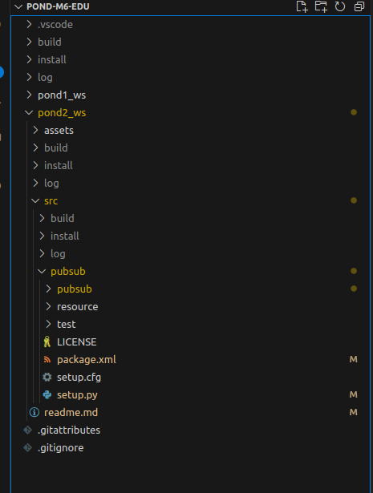
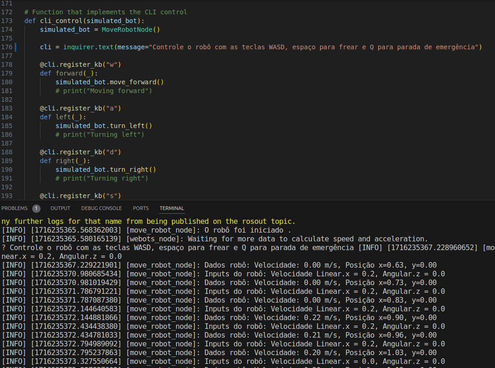
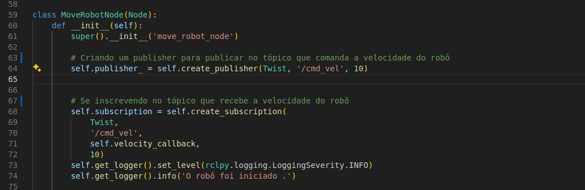
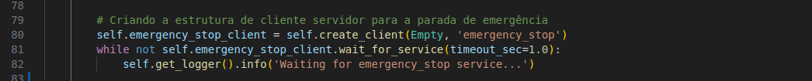
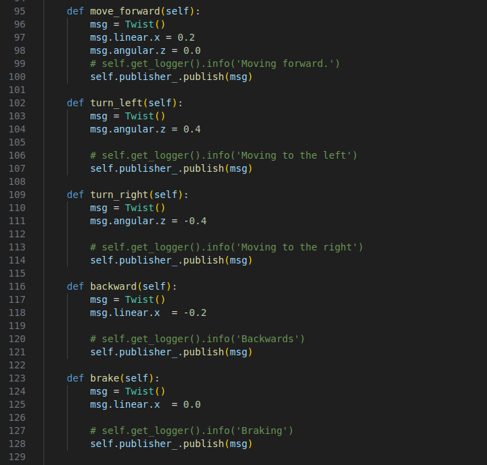
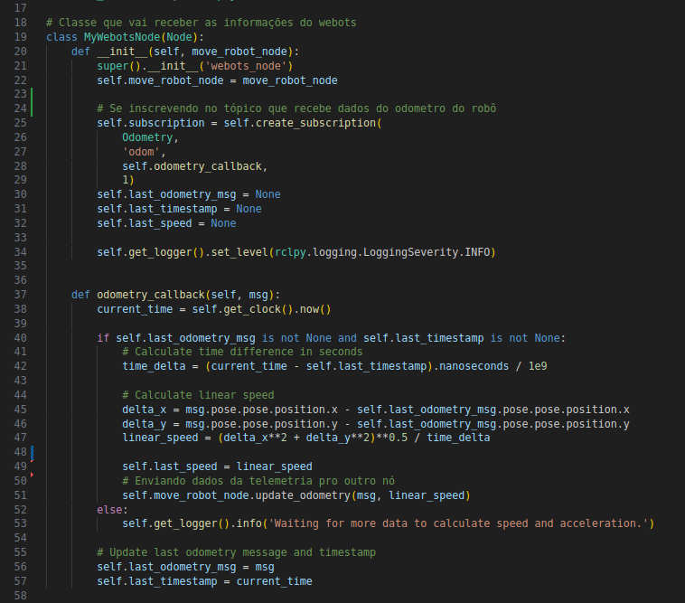

# Atividade ponderada - 2

## Objetivo 
O objetivo dessa atividade é criar um pacote ros que contenham as estruturas de tópicos e serviços para interagir com o robô turtlebot atráves do simulador webots. As interações são feitas a partir da CLI e leituras do robô são mostradas na cli também. 

## Atividades Desenvolvidas 

Nesta atividade foram desenvolvidos o workspace/pacote em ROS, contendo uma CLI, o tópico de controle do turtlebot, a inscrição no tópico de telemetria do turtlebot e a implementação de um serviço. 


### Workspace 

Na figura abaixo é possível conferir o workspace desenvolvido de acordo com o padrão ROS2. 

   

### CLI 
A CLI permite ao usuário interagir com os tópicos e serviços desenvolvidos. Ela foi desenvolvida com a biblioteca inquirer e permite todas interações. 

   


### Tópicos
Os tópicos foram utilizados para permitir que exista a conexão direta entre o código que controla o robô e o recebimento de informações do tópico de telemetria do robô. 

   


### Serviços 

Os serviços são um método de comunicação entre nós ros utilizado para mandar mensagens em um padrão que não exista necessidade de ser uma conexão direta como um tópico.

O serviço desenvolvido foi o do sistema de emergência. Que define as velocidades do robô em zero e mata a conexão do nó. 

   

### Parada de emergência 

O sistema de emergência foi feito com uma estrutura de serviços. Assim, quando o usuário decide apertar a tecla *Q* é ativado a função de parada e cessa toda comunicação com o nó do webots. 

   

### Controle do robô
O sistema de controle do robô permite que a partir da cli o usuário consiga interagir com funções que foram definidas para o robô. Nesse caso da ponderada o robô tem as seguintes funções e com controles.

- Mover para Frente : tecla *w*
- Mover para Direita : tecla *d* 
- Mover para Esquerda : tecla *a*
- Mover de Ré : tecla *s*
- Freiar : tecla *espaço*

   


### Telemetria 

O sistema de telemetria retorna os dados da velocidade linear do robô e sua posição nas coordenadas x e y. Para isso foi feito a inscrição no tópico /odom do webots. 

   


## Como utilizar a solução 

Em primeiro lugar é preciso estar com o Ubuntu 22.04 e o pacote ROS instalado. Caso essa etapa não esteja feita, recomendo seguir o seguinte tutorial para configurar o ambiente de desenvolvimento **[tutorial instalação ROS2](https://rmnicola.github.io/m6-ec-encontros/E01/ros)**.Além disso é preciso instalar o Webots para que seja possível rodar a simulação. 

Só basta executar no terminal: 
  ```console
sudo apt install webots
  ``` 


Considerando que o usuário já está em um ambiente Linux com o pacote ROS já configurado para rodar o projeto é preciso seguir os seguintes passos. 

 1. No terminal é preciso acessar a pasta raiz do workspace 

    ```console
    cd pond2_ws/src
    ``` 

2. Após garantir que o terminal está dentro da raíz do workspace é preciso construir o pacote. Continuando no terminal é executado o seguinte comando 

    ```console
    colcon build
    ``` 

3. Com o pacote construido só basta executar :


    ```console
	. install/setup.bash
      ```

4. Agora só basta executar o pacote e conferir o resultado. No mesmo terminal execute : 

    ```console 
    ros2 run pubsub talker 
    ```  

5. Em outro terminal é preciso rodar o webots. Esse comando permite o usuário simular o turtlebot. 


    ```console
    ros2 launch webots_ros2_turtlebot robot_launch.py
    ``` 


Caso existam dúvidas sobre como instalar é possível conferir no vídeo de funcionamento abaixo como é feito o processo para instalar e utilizar a solução. 


## Demonstração dos trabalhos realizados 

No vídeo abaixo é possível conferir como executar o projeto e o funcionamento do mesmo. 

[](https://www.youtube.com/watch?v=iquhxcx8Fas)

