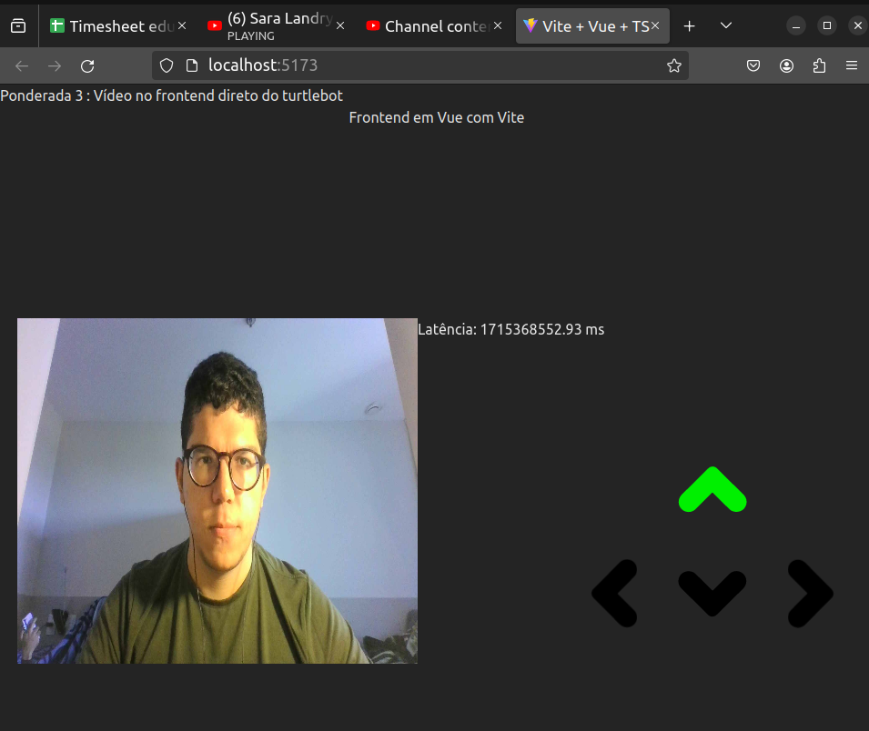

# Atividade ponderada - 3

## Objetivo 

Com base nas atividades desenvolvidas na última ponderada é preciso implementar um frontend que faça a conexão com o robô e implementar um sistema de transmissão de imagens.


## Atividades Desenvolvidas 

### Backend do robô 
Pensando em modularização desenvolvi ambos backends de forma separada. Na API do robô o objetivo é permitir a movimentação do mesmo e ocorrer a troca de informações pelo websocket. 
A movimentação é feita no frontend utilizando os seguintes comandos:

- Mover para Frente : tecla *w*
- Mover para Direita : tecla *d* 
- Mover para Esquerda : tecla *a*
- Mover de Ré : tecla *s*

O código pode ser acessado em: 

    ```console
    cd pond3_ws/backend/robot.py
    ``` 


### Backend da câmera 
A api da câmera coleta as imagens da webcam e atráves de websocket manda um string constante de bytes que no frontend são convertidos para a imagem. Esse método não é um dos mais eficientes visto que o delay é quase de dois segundos. 

O código pode ser acessado em: 

    ```console
    cd pond3_ws/backend/video.py
    ``` 

### Frontend
O frontend foi desenvolvido em Vue. Existem três artefatos principais. A tela de home que aloca os componentes de controle e vídeo. É dentro dos componentes que ocorre a comunicação com o websocket e o usuário pode interagir com o frontend 

   


## Como utilizar a solução 

Em primeiro lugar é preciso estar com o Ubuntu 22.04 e o pacote ROS instalado. Caso essa etapa não esteja feita, recomendo seguir o seguinte tutorial para configurar o ambiente de desenvolvimento **[tutorial instalação ROS2](https://rmnicola.github.io/m6-ec-encontros/E01/ros)**.Além disso é preciso instalar o Webots para que seja possível rodar a simulação. 

Só basta executar no terminal: 
  ```console
sudo apt install webots
  ``` 


Considerando que o usuário já está em um ambiente Linux com o pacote ROS já configurado para rodar o projeto é preciso seguir os seguintes passos. 


2. Primeiro é preciso estar dentro da raíz do backend e ligar a venv para instalar os requirements.

    ```console python3 - venv venv
        source venv/bin/activate 
        python3 pip install -r requirements.txt
    ``` 
Em outro terminal é recomendado executar os mesmos passos anteriores. Visto que, são dois arquivos de backend. 


3. Com o setup correto é só rodar o backend para movimentar o robô:


    ```console
	 python3 robot.py
    ```

4. Novamente no outro terminal é preciso rodar o backend para ligar a câmera: 


    ```console
	 python3 video.py
    ```

5. Agora só basta abrir outro terminal e instalar o frontend para usufruir da solução: 

    ```console 
    cd frontend/pond3

    npm install

    npm run dev
    ```  
  Logo em seguida é possível acessar o local host e usar a interface. 

6. Em outro terminal é preciso rodar o webots. Esse comando permite o usuário simular o turtlebot e controlar pelo frontend. 


    ```console
    ros2 launch webots_ros2_turtlebot robot_launch.py
    ``` 


Caso existam dúvidas sobre como instalar é possível conferir no vídeo de funcionamento abaixo como é feito o processo para instalar e utilizar a solução. 


## Demonstração dos trabalhos realizados 

No vídeo abaixo é possível conferir como executar o projeto e o funcionamento do mesmo. 

[](https://www.youtube.com/watch?v=s_AFyfMYiwI )

