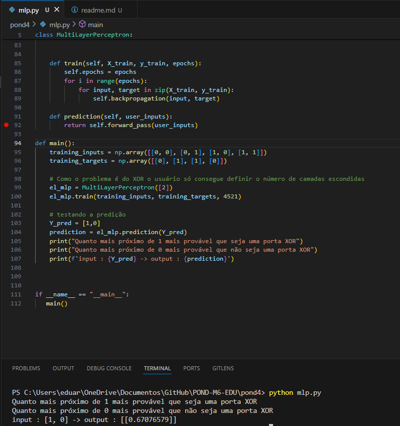

# Atividade ponderada - 3

## Objetivo 

Desenvolver um multilayer perceptron que consiga resolver o problema do XOR. 

## Atividades Desenvolvidas 

### Multilayer perceptron
O MLP foi criado para implementar do zero uma rede neural. 

O código pode ser acessado em: 

    cd pond4/mlp.py

### Rede neural com o pytorch 
Foi criado uma rede neural baseada no código do mlp utilizando o pytorch.

O código pode ser acessado em: 

    cd pond4/mlp_pytorch.ipynb


## Como utilizar a solução 


1. Só basta definir uma array na váriavel 'y_pred' e testar o MLP.

    ```console 
        python mlp.py
    ``` 


## Demonstração dos trabalhos realizados 

Na figura abaixo é possível ver o funcionamento do MLP. 


